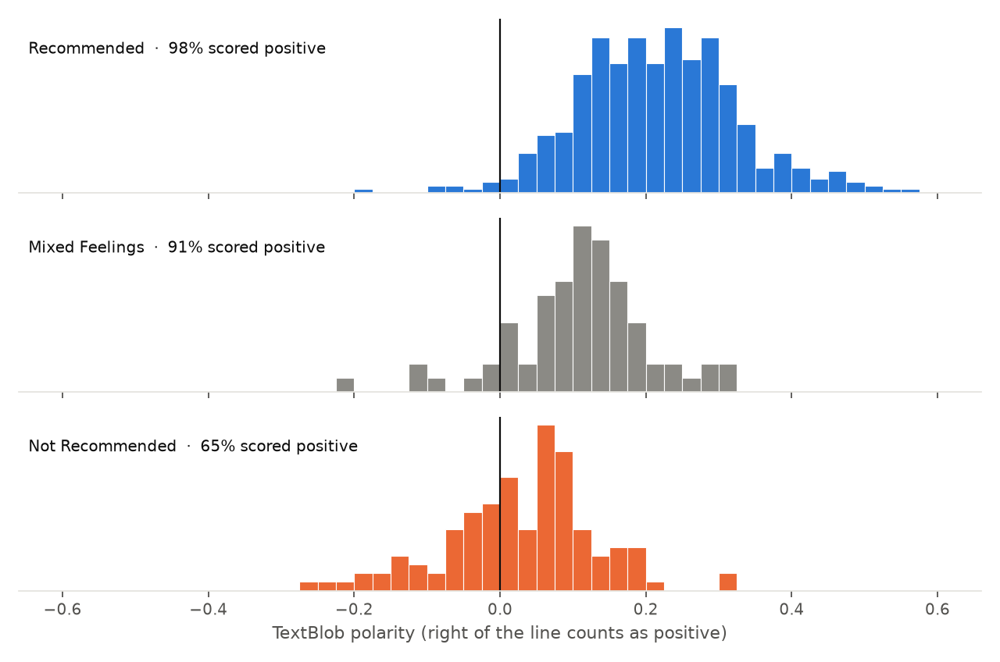
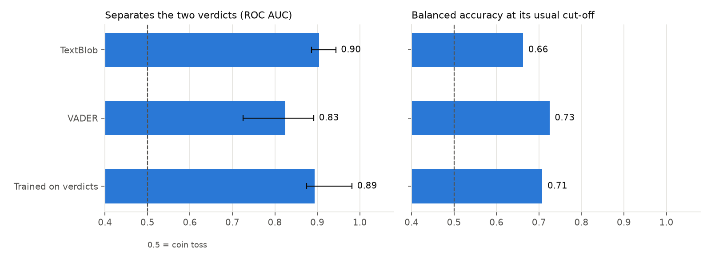
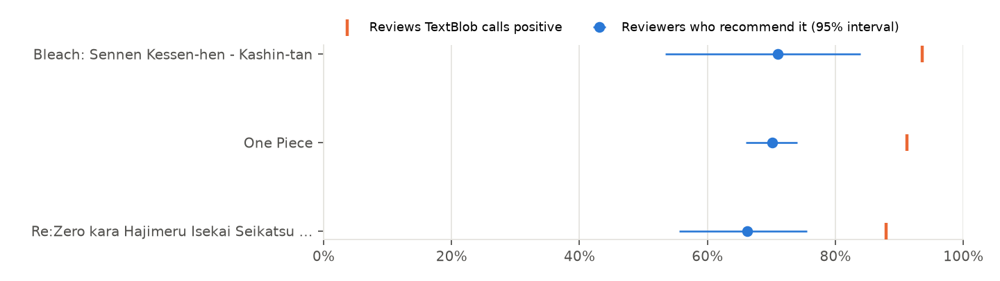

# Results

660 reviews of 9 shows, each tagged by its author as Recommended (465), Mixed Feelings (74), Not Recommended (121).
Dropped before analysis: 0 with no verdict tag, 0 empty, 1 duplicates.

## The anime

The top 10 of MyAnimeList's top airing chart on 2026-09-30, with every review of each (up to 500):

| # | Anime | MAL score | Reviews |
| ---: | --- | ---: | ---: |
| 1 | Re:Zero kara Hajimeru Isekai Seikatsu 4th Season | 9.11 | 83 |
| 2 | Steel Ball Run: JoJo no Kimyou na Bouken | 9.07 | 2 |
| 3 | Bleach: Sennen Kessen-hen - Kashin-tan | 9.03 | 31 |
| 4 | One Piece | 8.72 | 500 |
| 5 | Chiikawa | 8.62 | 8 |
| 6 | Seihantai na Kimi to Boku 2nd Season | 8.51 | 18 |
| 7 | Shiguang Dailiren III | 8.51 | 2 |
| 8 | Xian Ni | 8.49 | 13 |
| 9 | Tian Guan Cifu Short Films | 8.47 | 0 |
| 10 | Doupo Cangqiong: Nian Fan | 8.39 | 4 |

## What TextBlob says

TextBlob calls 91.1% of reviews positive. The reviewers themselves recommend 70.5% of the shows they review, and TextBlob scores 65% of **Not Recommended** reviews as positive.

## How well each method matches the verdict

Recommended vs Not Recommended: 586 reviews (465 vs 121). Five-fold cross-validation split by show, so every review is scored by a model that never saw that show. Balanced accuracy averages the hit rate on each verdict, so always answering "Recommended" scores 50%.

| Method | ROC AUC (95% CI) | Balanced accuracy, usual cut-off | Balanced accuracy, tuned cut-off | Not Recommended caught |
| --- | ---: | ---: | ---: | ---: |
| TextBlob | 0.90 (0.89–0.94) | 66% | 84% | 35% |
| VADER | 0.83 (0.72–0.89) | 73% | 72% | 50% |
| Trained on verdicts | 0.89 (0.87–0.98) | 71% | 81% | 45% |

Best at separating the verdicts: **TextBlob**.

## Three verdicts

Trained on all three tags, the model reaches a macro F1 of 0.48 and balanced accuracy of 49%. Rows are the reviewer's tag, columns the model's guess:

| | Recommended | Mixed Feelings | Not Recommended |
| --- | ---: | ---: | ---: |
| **Recommended** | 445 | 2 | 18 |
| **Mixed Feelings** | 53 | 1 | 20 |
| **Not Recommended** | 62 | 0 | 59 |

## By show

Shows with at least 20 reviews (3). Rank correlation with the share of reviewers who recommend the show: TextBlob 1.00, trained model -0.50.

| Show | Reviews | Recommended (95% CI) | Not Recommended | TextBlob positive |
| --- | ---: | ---: | ---: | ---: |
| Bleach: Sennen Kessen-hen - Kashin-tan | 31 | 71% (53%–84%) | 23% | 94% |
| One Piece | 499 | 70% (66%–74%) | 18% | 91% |
| Re:Zero kara Hajimeru Isekai Seikatsu 4th Season | 83 | 66% (56%–76%) | 23% | 88% |

## What the trained model listens to

Words and phrases with the largest weights toward each verdict:

- **Recommended:** amazing, love, 10 10, very, best, the best, peak, you, unique, anime and, awesome, cour, incredible, different, though
- **Not Recommended:** worst, the worst, bad, same, minutes, stupid, plot, worse, boring, show, the same, any, waste, no, repetitive

## Caveats

- Reviews of the top airing chart on MyAnimeList, downloaded 2026-09-30. Reviewers who write reviews are not all viewers, so these rates describe reviews, not audiences.
- A tag is a single summary of a long, often mixed review; some disagreement with any method is expected.
- Scores come from English text only; reviews in other languages were left as they are.
